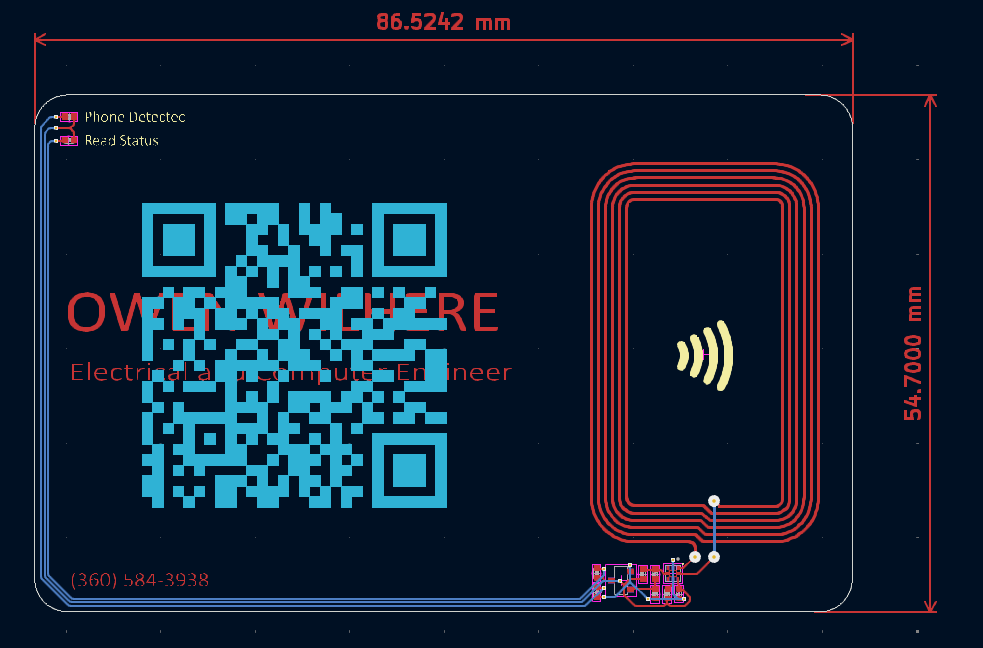

# NFC-Powered PCB Business Card

An interactive, battery-free printed circuit board that functions as a digital business card. 

This board utilizes Near Field Communication (NFC) to wirelessly transmit contact information, a portfolio link, or a vCard to any NFC-enabled smartphone. Additionally, the circuit harvests energy from the scanning device's RF field to illuminate LEDs, providing visual feedback when the card is being read.

## ⚡ Features

* **Passive NFC Connectivity:** Uses an NTAG series IC to store NDEF formatted data (URLs, Text, Contact Info). No battery required.
* **Energy Harvesting:** On-board LEDs light up instantaneously when the card is brought within the RF field of a reader/phone.
* **Hybrid Design:**
    * **Front:** Clean aesthetic with LED indicators and antenna design.
    * **Back:** Silkscreen/Soldermask QR code for scanning.
* **Compact Form Factor:** Standard credit card dimensions (85.6mm x 54mm).

### Business Card Front

### Layout View
